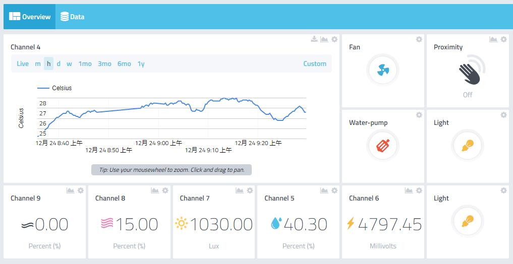
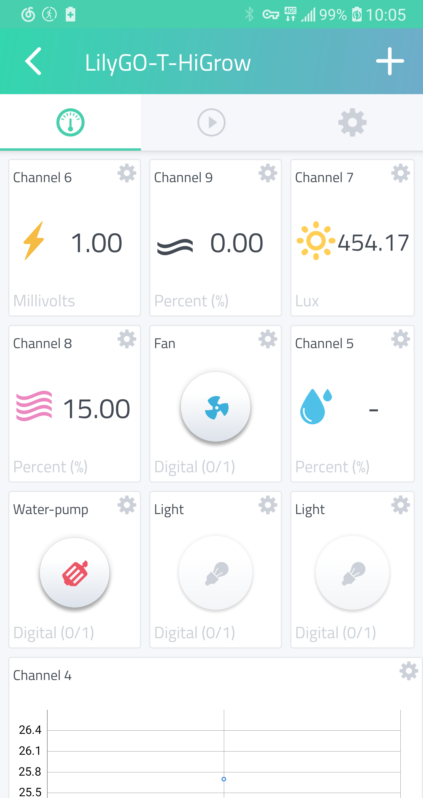

# T-HiGrow Dashboard

💦 ☀💨🌹 The sample code is based on the **[LilyGO T-HiGrow](https://www.aliexpress.com/item/32815782900.html)** multi-sensor board, which gets the on-board sensor data and uploads it to **[Cayenne](https://cayenne.mydevices.com/)**.

# Steps:
1. Install [Visual Studio Code](https://code.visualstudio.com/) on your pc, Install PlatformIO in the extension, or you can install [PlatformIO IDE](https://platformio.org/platformio-ide),it's built on top of [Microsoft's Visual Studio Code](https://code.visualstudio.com/)
2. Set the Cayenne authentication info to match the authentication info from the Dashboard.If you don't have an account, then [create an account](https://accounts.mydevices.com/auth/realms/cayenne/login-actions/registration?client_id=cayenne-web-app&tab_id=01AaoLwmlng)
3. After logging in, you will see the dashboard, click **Add new** in the upper left,Choose **Generic ESP8266**,Then you can see the MQTT username, password and ID you need to use,Replace it with the definition in `main.cpp`
4. Set the network name and password.
5. In `platformio.ini` you need to change the port number corresponding to your board
6. Compile and upload the sketch.(The arrow at the bottom left of the IDE editor)
7. A temporary widget will be automatically generated in the Cayenne Dashboard. To make the widget permanent click the plus sign on the widget.

# Cayenne data fields
